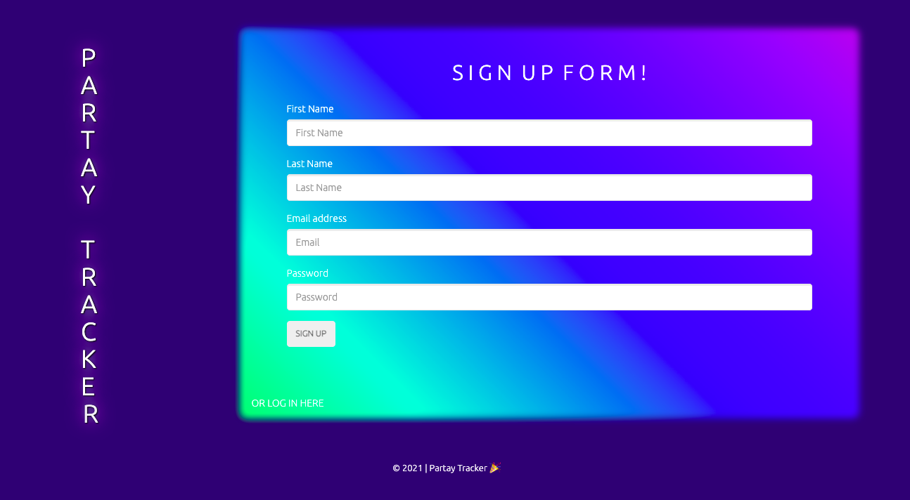
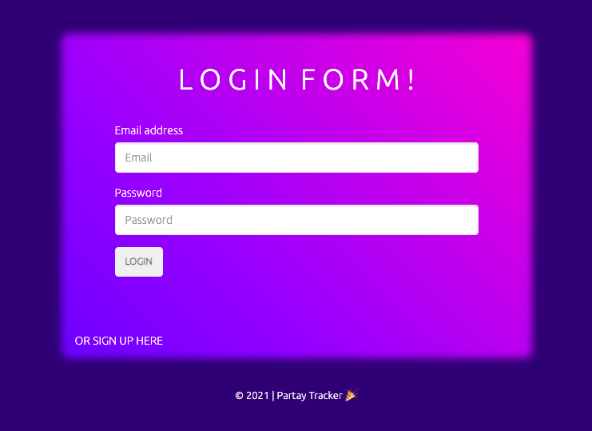
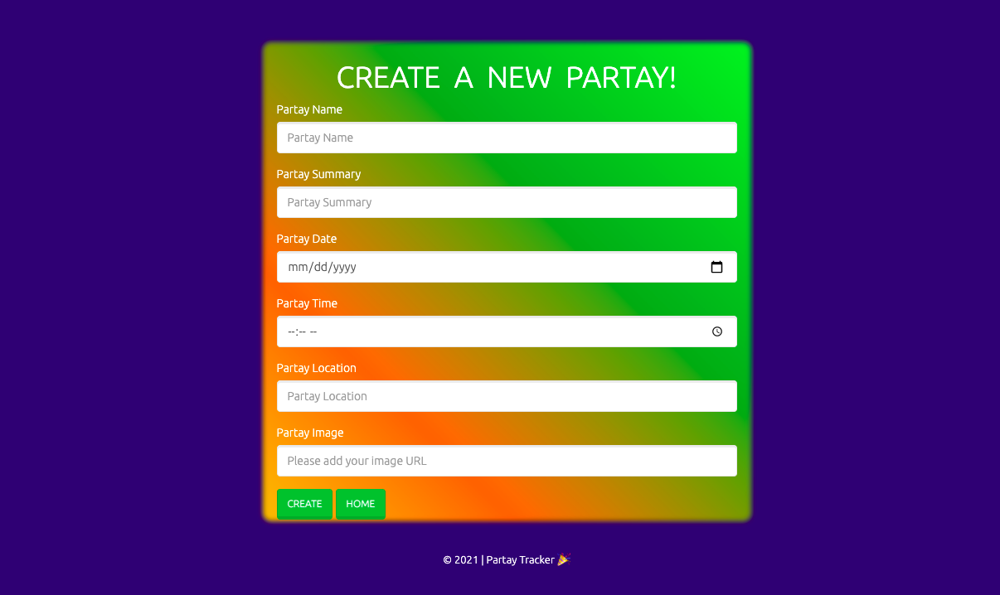
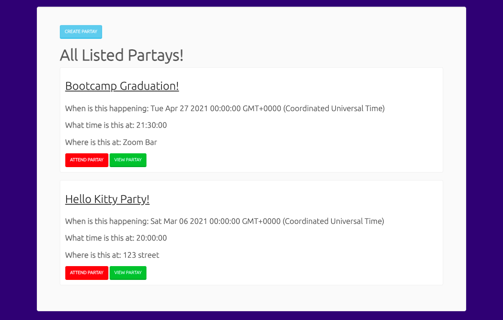

# Partay Tracker 
A web application that allows users to create and attend events/partays occuring in your inner circle. Users can add important details to their event including title for party, summary, date, time, location, and an image. Users of the app can also stay in the loop of all the other events/parties being created through emailed notifications. 

## User Stories

- As a party thrower, I want my friends & family to be aware of the event(s) I am throwing, so that they have all the important details (date, time, location, etc).
- As a party goer, I want to see all the events happening in my social circle, so that I can keep track of what’s happening & when.

### Current Capabilities
- Ability to create new events
- Ability to add Event details
- Ability to indicate attendance
- Welcome Email/Notification upon app registration
- Notifications upon creation of new events

### Future Development
- Editing of events 
- Auto deletion of events once they’ve occured
- Allowing host to invite specific users to their event
- Ability for users to only see events they’ve been invited to
- Allow host to add items needed for event
- Allow users to sign up for items 
- Private social circles 

## Screenshots

##

##

##

##

## Technologies 
- MySQL
- Node
- Express
- Handlebars
- Sequelize
- Passport 
- Bootstrap
- Anime.js
- Nodemailer
- Confetti Library

## Credits
- https://nodemailer.com/about/
- https://www.npmjs.com/package/dotenv
- https://animejs.com/
- https://www.jqueryscript.net/tags.php?/confetti/
- https://sequelize.org/master/index.html
- https://www.npmjs.com/
- Pete's Sis
- Northwestern Bootcamp TAs & Instructor Josh

## Contributors
- Aika Kuo
- Manpreet Lakhan
- Pete Scale
- Michael Rosa-Vourazeris