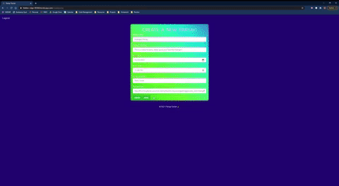
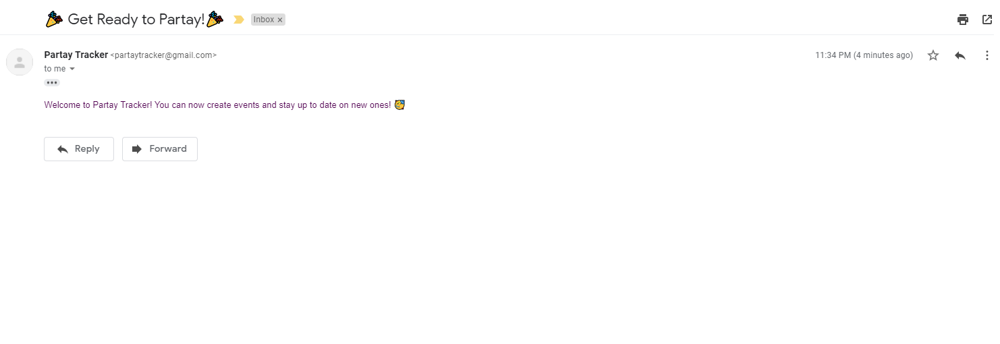
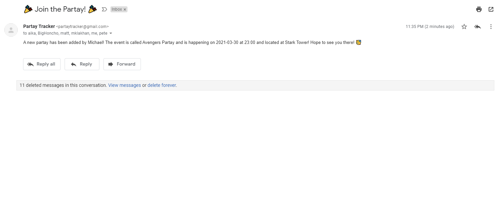

# Partay Tracker 

## Description 
A web application that allows users to create and attend events/partays occurring in their social circle. Users can add important details to their event including a title, summary, date, time, location, and an image. Users of the app can also stay in the loop of all other events/parties being created through emailed notifications. 

---

## Table of Contents

* [Installation](#installation)
* [User Stories](#user-stories)
* [Current Capabilities](#current-capabilities)
* [Future Development](#future-development)
* [Usage](#usage)
* [Screenshots](#screenshots)
* [Tests](#tests)
* [Deployed Site](#deployed-site)
* [Technologies](#technologies)
* [Credits](#credits)
* [Contributors](#contributors)
* [Contributing](#contributing)
* [License](#license)

---

## Installation
1) Copy the HTTPS link from repository 
2) Open the folder you wish to add this application to in your code editor. 
3) Open the integrated terminal in the selected folder. 
4) Run git clone and paste HTTPS link from repository. 
5) Run "npm i" to install  the node modules associated with this application.
6) Change password in config.json under development to match your MySQL password
7) In the terminal, type in "node server.js" to run the application, enjoy!

---

## User Stories

- As a party thrower, I want my social circle to be aware of the event(s) I am throwing, so that they have all the important details (date, time, location, etc).
- As a party goer, I want to see all the events happening in my social circle, so that I can keep track of what’s happening & when.

---

### Current Capabilities
- Ability to create new events
- Ability to add Event details
- Ability to indicate attendance
- Welcome Email/Notification upon app registration
- Notifications upon creation of new events

---

### Future Development
- Editing of events 
- Auto deletion of events once they’ve occured
- Allowing host to invite specific users to their event
- Ability for users to only see events they’ve been invited to
- Allow host to add items needed for event
- Allow users to sign up for items 
- Private social circles 

---

## Usage 

---

## Screenshots

---

## Tests
[Test of the application](https://drive.google.com/file/d/1EPUFHJj9kkcOJrQDE88PS_fkuI3amRlz/view?usp=sharing)

---

## Deployed Site
[Live Site](https://hidden-ridge-88260.herokuapp.com/)

---

## Technologies 
- MySQL
- Node
- Express
- Handlebars
- Sequelize
- Passport 
- Bootstrap
- Anime.js
- Nodemailer
- Confetti Library

---

## Credits
- https://nodemailer.com/about/
- https://www.npmjs.com/package/dotenv
- https://animejs.com/
- https://www.jqueryscript.net/tags.php?/confetti/
- https://sequelize.org/master/index.html
- https://www.npmjs.com/
- https://www.w3schools.com/
- https://handlebarsjs.com/
- https://getbootstrap.com/docs/3.3/
- https://stackoverflow.com/questions/45563842/set-raw-true-on-sequelize-model-create
- https://stackoverflow.com/questions/42521665/select-from-multiple-tables-sequelize
- Mary Scale
- Northwestern Bootcamp TAs & Instructor Josh

---

## Contributors

#### Front End 
- Aika Kuo
- Manpreet Lakhan
#### Back End
- Pete Scale
- Michael Rosa-Vourazeris

---

## Contributing
Anyone can contribute to this application by forking the repo, adding their code to the application, and then sending any of the contributors a pull request so the main branch can be updated.

---

## License Under

### MIT License

Permission is hereby granted, free of charge, to any person obtaining a copy
of this software and associated documentation files (the "Software"), to deal
in the Software without restriction, including without limitation the rights
to use, copy, modify, merge, publish, distribute, sublicense, and/or sell
copies of the Software, and to permit persons to whom the Software is
furnished to do so, subject to the following conditions:

The above copyright notice and this permission notice shall be included in all
copies or substantial portions of the Software.

THE SOFTWARE IS PROVIDED "AS IS", WITHOUT WARRANTY OF ANY KIND, EXPRESS OR
IMPLIED, INCLUDING BUT NOT LIMITED TO THE WARRANTIES OF MERCHANTABILITY,
FITNESS FOR A PARTICULAR PURPOSE AND NONINFRINGEMENT. IN NO EVENT SHALL THE
AUTHORS OR COPYRIGHT HOLDERS BE LIABLE FOR ANY CLAIM, DAMAGES OR OTHER
LIABILITY, WHETHER IN AN ACTION OF CONTRACT, TORT OR OTHERWISE, ARISING FROM,
OUT OF OR IN CONNECTION WITH THE SOFTWARE OR THE USE OR OTHER DEALINGS IN THE
SOFTWARE.
